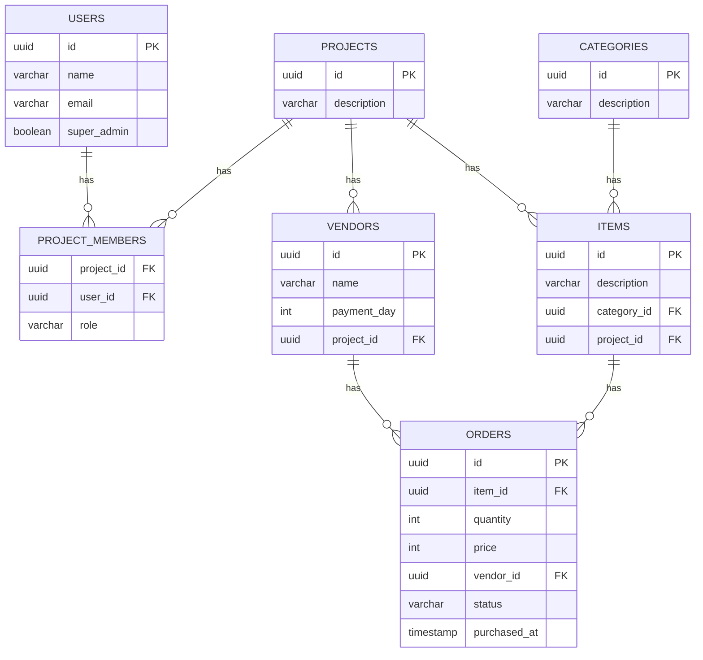

# Database Model

## Entity Relationship Diagram

## Table Definitions

### users
| Column | Type | Constraints |
|--------|------|-------------|
| id | uuid | PK |
| name | varchar(255) | NOT NULL |
| email | varchar(255) | NOT NULL, UNIQUE |
| super_admin | bool | NOT NULL, DEFAULT false |

### projects
| Column | Type | Constraints |
|--------|------|-------------|
| id | uuid | PK |
| description | varchar(255) | NOT NULL |

### project_members
| Column | Type | Constraints |
|--------|------|-------------|
| project_id | uuid | PK, FK → projects.id |
| user_id | uuid | PK, FK → users.id |
| role | varchar(255) | NOT NULL |

### vendors
| Column | Type | Constraints |
|--------|------|-------------|
| id | uuid | PK |
| name | varchar(255) | NOT NULL |
| payment_day | int | NULL |
| project_id | uuid | FK → projects.id |

### categories
| Column | Type | Constraints |
|--------|------|-------------|
| id | uuid | PK |
| description | varchar(255) | NOT NULL |

### items
| Column | Type | Constraints |
|--------|------|-------------|
| id | uuid | PK |
| description | varchar(255) | NOT NULL |
| category_id | uuid | FK → categories.id |
| project_id | uuid | FK → projects.id |

### orders
| Column | Type | Constraints |
|--------|------|-------------|
| id | uuid | PK |
| item_id | uuid | FK → items.id |
| quantity | int | NOT NULL |
| price | int | NOT NULL |
| vendor_id | uuid | FK → vendors.id |
| status | varchar(255) | NOT NULL, CHECK (status IN ('to_pickup', 'paid')) |
| purchased_at | timestamp | NOT NULL, DEFAULT now() |

## Notes
- All primary keys are UUIDs
- Foreign keys use `ON DELETE CASCADE` where appropriate
- `project_members` uses a composite primary key (project_id, user_id)
- `payment_day` in vendors represents the day of month for payment terms (nullable)
- `status` in orders: 'to_pickup' = aguardando retirada/pagamento futuro, 'paid' = já pago
- Orders with vendor and status='to_pickup' are batched for payment on the vendor's `payment_day` of the following month
- `purchased_at` records when the order was placed